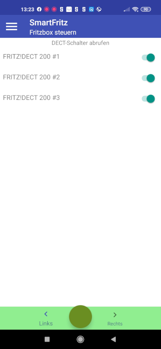
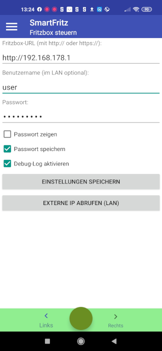
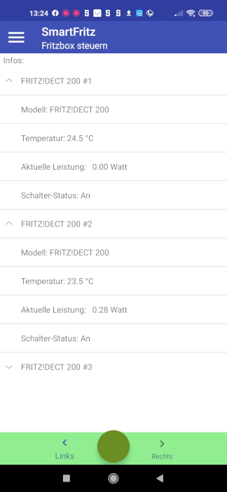
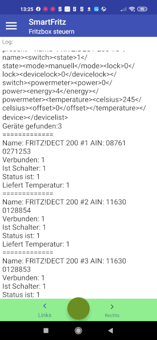

# lamw

**Einführung in die Android-Entwicklung mit Lazarus und Free Pascal**

Demo-Projekt am Beispiel der Steuerung einer Fritzbox (Smart Home)

Die bevorzugten Programmiersprachen für Android-Apps sind Java und Kotlin. Hier soll es jedoch um den **Free Pascal Compiler** (FPC) gehen.

Zusammen mit der Entwicklungsumgebung **Lazarus** und einigen Erweiterungen lassen sich Android-Apps relativ komfortabel erstellen. Wir erläutern die nötigen Schritte am Beispiel eines Projekts, mit dem sich eine Fritzbox (Smart Home) steuern lässt. 

Die Android-Beispiel-App erläutert die folgenden Aufgaben:

- Android-Benutzeroberfläche erstellen und Elemente ausrichten
- Bedienelemente zur Laufzeit erzeugen
- Einstellungen speichern und wieder einlesen
- Abfragen über einen HTTP-Client
- Eine SOAP-Abfrage erstellen (ölffentliche IP-Adresse ermitteln)

**Projekt für Linux/Windows**

SmartFritzSchalter eignet sich für Linux oder Windows. Es enthält im Wesentlichen den gleichen Quellcode wie die Android-App, was die Programmlogik betrifft. Es empfiehlt sich, immer zuerst für Linux zu programmieren, soweit das die gewünschten Funktionen zulassen. Ein Linux-Projekt lässt sich debuggen, was bei der Android-App nur sehr eingeschränkt möglich ist.

**Benötigte Software**

Fpcupdeluxe (Lazarus/FPC installieren): https://github.com/LongDirtyAnimAlf/fpcupdeluxe/releases

Zusätzliche Pakete für Linux (Ubuntu/Mint):
```bash
sudo apt install libx11-dev libgdk-pixbuf2.0-dev libpango1.0-dev libgtk2.0-dev subversion git freeglut3-dev
```

Zusätzliche Module (über Fpcupdeluxe installieren): ECCControls, hashlib4pascal und lamw

Android Studio für Linux (Android SDK/NDK): https://developer.android.com/studio

**App im Android-Emulator starten**

In Lazarus erzeugen Sie das Installationspaket („apk“) mit Strg-F1 („Start -> [LAMW] Build Android Apk and Run“). Das Programm wird automatisch auf den laufenden Android-Emulator (Android Studio) oder ein per USB angeschlossenes Android-Gerät übertragen und gestartet.

**Anders als im Artikel angegeben**, hat die aktuelle Version des Android-Emulators auch Zugriff auf das lokale Netzwerk.
Es sind daher keine weiteren Masßnahmen erforderlich.


**HTTP-Verbindungen und Passwörter**

Bei einer HTTP-Verbindung (http://192.168.178.1) möchte Android das Passwort nicht im Klartext über das Neztzwerk senden.
Damit das möglich ist, erstellen Sie bei einer App im Ordner "res/xml" die Datei "network_security_config.xml" mit diesem Inhalt:

```xml
<?xml version="1.0" encoding="utf-8"?>
<network-security-config>
    <base-config cleartextTrafficPermitted="true">
        <trust-anchors>
       <certificates src="@raw/my_ca"/>
            <certificates src="system" />
            <certificates src="user" />
         </trust-anchors>
    </base-config>
</network-security-config>
```

In die Datei "AndroidManifest.xml" wird die Konfiguration eingebunden:

```xml
  <application android:allowBackup="true" android:icon="@drawable/ic_launcher" android:label="@string/app_name" android:theme="@style/AppTheme" android:networkSecurityConfig="@xml/network_security_config">
  ...
   </application>
```
Im SmartFritz-Projekt sind diese Änderungen bereits enhalten. HTTPS-Verbindungen sind nicht betroffen.

**So sieht die Demo-App unter Android aus:**






